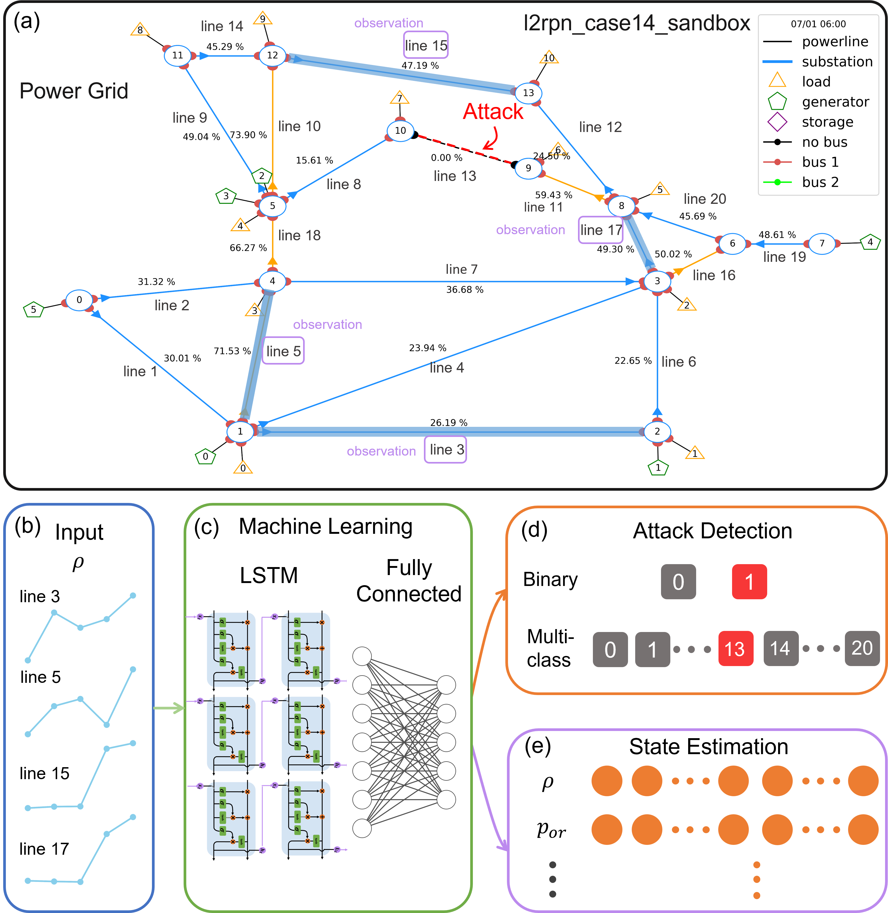

# Power-grid-attack-detection-and-state-estimation-with-machine-learning
Detecting attacks and estimating states of power grids from partial observations with machine learning. A manuscript submitted to PRX Energy. 

The key idea is to build a machine-learning based approach to detecting and locating the source of disturbance or attack as well as state estimation from partial state observations. 

We train the LSTM networks on historical power grid data so as to learn the underlying dynamical patterns and trends in the data. This allows us to reconstruct the full state from partial observations and identify the source of disturbances. We carry out a robustness analysis by evaluating the performance under different levels of partial observations, demonstrating the ability to detect attacks accurately even when the observed data is quite limited. Two benchmark systems of distinct scales are used in our study: the RTE-14 bus and the IEEE-118 bus systems. 

# Running Example

The [Grid2Op](https://github.com/Grid2op/grid2op) package is used for simulating the power-grid dynamics, and [Tensorflow keras](https://github.com/tensorflow/tensorflow) is employed for building machine learning based approach. 

Run `data_generation.py` to generate power grid simulation data. You may set 'env_name' to 'l2rpn_case14_sandbox' or select other benchmark power grid networks. The original data used in this work is available on Zenodo and can be downloaded from [here](https://doi.org/10.5281/zenodo.14004431). To proceed with the machine learning code, either download the data and move it to the 'data' folder or generate the data yourself.

